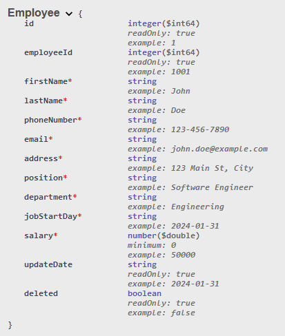
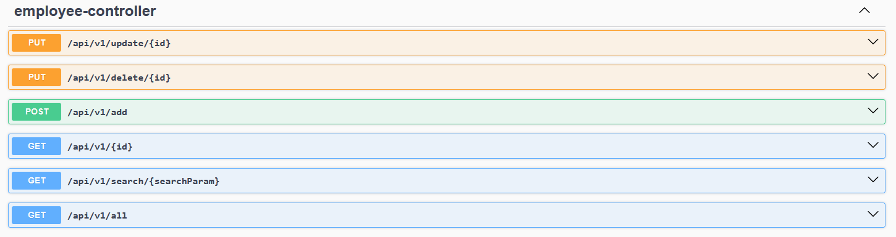

### Employee Management REST API

Simple back-end API for `Employee Management Application`.
Can find front-end at this repository: [JS-REACT]()

API has all CRUD operations:
1. Get Employees.
2. Get Employee.
3. Add Employee.
4. Search for Employee.
5. Update Employee.
6. Delete Employee.

